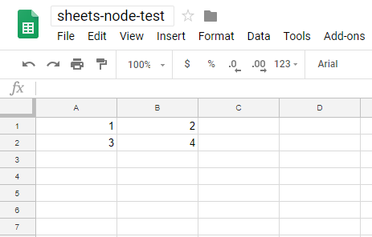

## Google Spreadheets and Node JS

The script creates a Node JS endpoint which will save data to a Google Sheets spreadsheet.

### Setting Up

1. Clone the repository.
1. Run `npm install`.
1. Update `SPREADSHEET_ID` in `index.js` to your desired spreadsheet.
1. Go to the [documentation](https://developers.google.com/sheets/api/quickstart/nodejs) and follow Step 1 to turn on the Google Sheets API. Save the resulting `credentials.json` file in your project root.
1. Run `node .`. You will be asked to visit a URL and paste the resulting code into your command line.
1. Success. You can now send POST requests to your endpoint (e.g. localhost:3000) and the data will be saved to your Google Sheets spreadsheet. Below is an example JSON POST request and the resulting update:

```
{
	"data": [[1,2], [3,4]]
}
```

